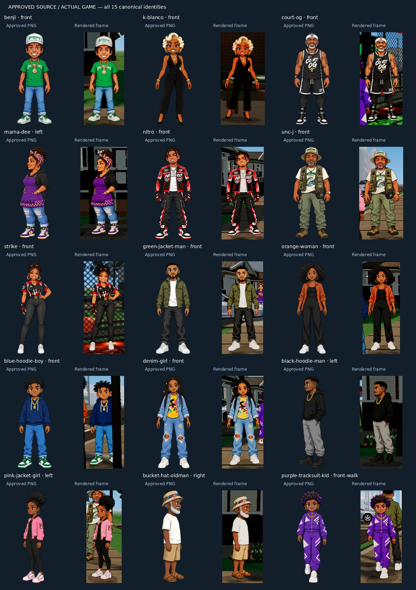

# Claude canonical installation — production browser QA, 2026-10-10

The actual Three.js game was built and launched in Chromium using software WebGL. This folder contains 25 full gameplay/UI screenshots and a comparison of all 15 canonical character identities against the approved PNGs. These are rendered game captures, not mockups.

## Approved artwork

The original `imports/Claude_Canonical_Sprites_Integration.zip` is preserved unchanged. SHA256: `4be5668e1296e1aab39a2256129466e829c5f9b65019061f7b6625e3cde9c4d0`.

All 85 supplied PNGs were installed byte-for-byte: 29 named cast frames, 40 pedestrian frames, and 16 vehicle source views. The four vehicle types also have exact runtime aliases for front/back/left/right. No canonical illustration was regenerated, recolored, mirrored, or replaced. All supplied files were decoded and their RGBA transparency checked during import.

Benji, K Blanco, Court OG, Mama Dee, Nitro, Unc J, Strike, and all eight pedestrians use the approved illustrations. The live game loaded all 68 directional/stride character textures. Actual keyboard movement verified A = left, D = right, W = back, S = front. Benji's four rendered directions are saved individually. Shoe placement uses measured alpha bounds and uniform scaling across poses; wide poses no longer change character height. Vehicles use their measured transparent margins to anchor the tires and preserve proportions.

`canonical-comparison.jpg` uses one actual rendered canvas frame per identity. Each crop and its pose metadata were captured in the same animation callback, then paired with the exact source PNG named by that frame. `comparison-metadata.json` records these source paths, camera settings and screen bounds. The comparison includes a live front-stride frame for the purple-tracksuit pedestrian. Other NPCs may turn or walk between full gameplay screenshots; `observations.json` records the sampled camera/state for those full captures rather than asserting a synchronized pose label.

## Checks run

- TypeScript: passed.
- ESLint: passed, zero errors; 14 existing warnings remain.
- Production build: passed. Local database migration skipped because no `DATABASE_URL` is configured.
- Canonical verifier: all 85 approved images and 16 runtime vehicle views match the preserved ZIP exactly.
- Importer: repeated successfully without artwork or registry changes.
- Gameplay: boot, real keyboard movement, camera orbit, ground contact, house/HQ entry and exit, road traffic, connected neighborhood, court/fishing anchors, mission pickup and Court OG delivery, reward persistence after reopening, desktop/mobile UI, basketball tap and hold/release.
- Final production browser checks: all 15 identities/68 textures, four keyboard directions, foundation and connected-slice assertions, basketball input, and 24 full gameplay/UI captures. No runtime errors or missing game-art responses. Basketball adds the 25th capture.

See [browser-checks.txt](browser-checks.txt). Reproduce with a running production preview using `npm run test:canonical`, `npm run test:visual`, and `node scripts/claude-comparison-qa.mjs`. Playwright supports `PLAYWRIGHT_CHROMIUM_EXECUTABLE_PATH`; screenshots default to `/workspace/screenshots/claude-canonical` or `QA_OUTPUT`.

## World changes verified in the running game

- Removed primitive vehicle cabins/wheels that obscured the approved artwork. Vehicle front/back/side orientation, dimensions, tire contact and road constraints are preserved.
- Fixed blue fringes around foliage through opaque alpha clipping; checked the neighborhood captures.
- Moved two idle neighbors to clear sidewalk positions so porch beams no longer cut through their heads.
- Cached lighting selection and limited local street lights by distance, place and time; checked Beale at night and court at golden hour.
- Captured HQ interior/exterior, neighborhood vehicles, 901 Court, Beale Street, riverfront and mobile gameplay.

[HQ interior](hq-k-blanco.png) · [HQ exterior](hq-exterior.png) · [Neighborhood/vehicles](neighborhood-vehicles.png) · [901 Court](901-court.png) · [Beale night](beale-night.png) · [Riverfront](riverfront.png) · [Mobile](mobile-neighborhood.png)

## Remaining visual issues

1. The approved pack has no true named-cast walk cycles. Benji's `front_alt` is an expression, so it is preserved as an unused alternate rather than misused as a stride. Pedestrians have one front stride; side/back travel still glides. New animation artwork requires approval.
2. Cars remain directional 2D artwork in a 3D world and can snap between views. World architecture, props, foliage, material transitions and river water still need detail. This is not a console-quality completed world.
3. Dense NPC groups and passing vehicles can still occlude characters. The reference-comparison crops were framed to show every identity; that does not eliminate all ordinary gameplay occlusion.
4. Beale's night exposure and riverfront/bridge composition need further polish. The ZIP supplies character/pedestrian/vehicle reference artwork, not a complete district-by-district approved world reference set.
5. Browser validation used software WebGL. Hardware GPU performance and appearance need separate device testing.

The branch and PR remain unmerged. GitHub-hosted CI status is separate from the local results above.
